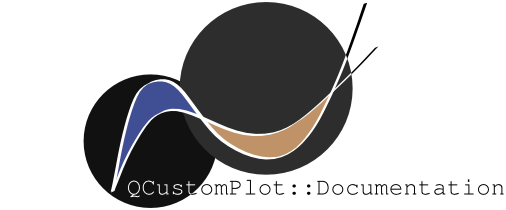

# **RDT** - Receiver Diagnostics Tool
RDT provides the ability to quickly compare calibration data files
graphically. The plots available are user configured and infinitely
extensible. This is the Qt C/C++ rework of the original RDT that was
provided via NI LabVIEW framework.

## **Table of Contents**
- [**Features**](#features)
    * [**C++17 STL**](#c17-stl-img-altc-logo-height33-srcassets1200px-iso_c_logosvgpng-width30)
    * [**Qt**](#qt-img-altqt-logo-height30-srcassetsqt_installer-256_480x480png-width30)
    * [**QCustomPlot**](#qcustomplot-img-altqcp-logo-height30-srcassetsqcp-doc-logopng-width65)
    * [**CMake 3**](#cmake-3-img-altcmake-logo-height30-srcassetscmake_logo_sliderpng-width50)
- [**User Guide**](#user-guide)
- [**Developer Guide**](#developer-guide)

## **Features**
This implementation of RDT uses a few of the latest development tools and
technologies. Some of which include:

* C++17 STL
* Qt5 & Qt6 for C/C++
* QCustomPlot Library
* CMake 3 (Multi-platform)

**C++17 STL** 
-------------
At the time of writing this C++17 is the latest C++ standard and provides
many new features for development. Only a few C++17 features are used in
this project because the Qt alternatives are preferred. It is mostly
preferred for its compiler optimizations.

More: [**C++17 STL**](https://en.cppreference.com/w/cpp/17)

**Qt** 
------
Qt is one of the largest and most intricate API/framework technology
available. Qt6 is the latest major release while Qt5 is used for much of
this project because of its fully integrated tools and build system. Qt can
be divided into 3 primary components that work together and independently to
provide a wide range of functionality.

* [Qt Core](#qt-core)
* [Qt Widgets](#qt-widgets)
* [Qt QML (Qt Quick)](#qt-qml-qt-quick)

### **Qt Core**
Qt Core provides the underlying framework that makes Qt unique and empowers
the other components to work so well. Qt Core provides wrappers for almost
all STL types and adds new types. These wrappers add basic functionality as
well as integrate the ability to leverage Qt's powerful object communication
system, **Signals** and **Slots**. Signals act as triggers or hooks that are
emitted as a Qt style interrupt in their query system. The user can then
define slots or events that associate with selected signal(s). Qt Core
provides a large supportive framework for these unique interrupt type calls
as well as many other powerful features such as: queryable and designable
object properties, hierarchical and queryable object trees, natural and
guarded object ownership, extensive dynamic casting, automated meta-object
framework, etc.

### **Qt Widgets**
Qt Widgets provides the base functionality for all widget-based GUI
components. All GUIs start with a parent-less widget called a **window**.
All widgets residing in the window are its children. All components are
derived from the QWidget base class that provides the fundamental
capabilities for creation, display, interactions and destruction. A
multitude of derived classes create various implementations for any UI
component desired. There are two primary design architectures associated
with Qt Widget components; **Widget-based** and **Model-View Controller (MVC)
**. Widget-based UI components rely primarily on altering properties and
attributes of the underlying widget. MVC maps aspects of the UI component
(View) to an underlying data structure (Model). MVC is more customizable and
flexible making it preferred for cases where the user requires more than the
basic functionality.

### **Qt QML (Qt Quick)**
Qt QML is Qt's new implementation of their graphical framework. It is
intended to replace the Qt Widget system as the preferred GUI design
platform. It uses a syntactically simplified XML language, QML. Qt Widgets
will remain viable and supported for a while. It is recommended that
developers interested in Qt become at least familiar with the QML (Qt Quick)
system.

### **Build Systems**
Qt5 and below use the QMake build system which, as name implies, is a Qt
wrapper on the CMake build system. QMake was necessary because compiling Qt
programs requires a few additional steps. Qt Core code requires creation of
Meta-objects via the **Meta-Object Compiler (MOC)**. This is a
pre-compilation step that produces the code necessary to support integration
of signals and slots. Programs containing UI components must convert UI XML
code into a C/C++ type object during the **UI Compilation (UIC)**
compile-time step.

The recent advancements of the open-source build system CMake, i.e. CMake 3,
have allowed it to be a viable standalone build system for Qt projects. This
has prompted Qt to recommend it as their preferred build system. QMake will
remain viable but will no longer receive software support moving forward.
Configuring older Qt projects (Qt5 and below) with CMake is a difficult task
and QMake may prove to be more convenient.

More: [**Qt**](https://www.qt.io/),
[**Qt Core**](https://doc.qt.io/qt-5/qtcore-index.html),
[**Qt Widgets**](https://doc.qt.io/qt-5/qtwidgets-index.html),
[**Qt Quick**](https://doc.qt.io/qt-5/qtquick-index.html),
[**QMake**](https://doc.qt.io/qt-5/qmake-manual.html),
[**Qt CMake**](https://doc.qt.io/qt-5/cmake-manual.html)

**QCustomPlot** 
---------------
QCustomPlot is an open-source Qt based library that provides plotting
implementations of Qt code. Plotting in Qt alone is tedious because Qt
provides only very basic plotting and drawing functionality. The QCustomPlot
(QCP) Library greatly extends Qt's plotting functionality by providing an
API and layout system that allows for detailed and powerful plots to be
created rapidly and flexibly.

More: [**QCustomPlot**](https://www.qcustomplot.com/index.php/introduction)

**CMake 3** 
-----------
CMake 3 is the latest implementation of the CMake build system. This system
is meant to automate much of the build system by having the user configure a
set of distributed CMake file types. Qt is rapidly working to integrate
building its projects with this system. This removes their need to maintain
a proprietary build tool (QMake) and can eventually allow them to integrate
into any IDE or pre-existing build systems. A modern C++ developer should be
familiar with the basics of CMake such as: adding files to a build,
configuring build settings and other basic functionality. This project
currently uses QMake as the Qt version provided by ManRAI is still Qt5.

More: [**CMake 3**](https://cmake.org/)

**User Guide**
--------------
This guide will cover the steps necessary for a user to setup and run an
executable instance of Qt RDT.

### **Windows 10**
#### **Requirements**
* Program Executable `RDT.exe`
* Runtime Libraries `*.dll`
* RDT Configuration Folder `config/`

The Windows Dynamically Linked Libraries (DLLs) should be included with the
executable. If the executable resides in the same directory as the necessary
libraries then no system environment modifications should be required to run
the executable. If the user would like to call the executable from a
different location then they should create a shortcut to the executable (RDT.
exe). The RDT `config/` folder is required to be located in the same
directory as the executable.

### **Unix**
#### **Requirements**
* Program Executable `RDT` or `RDT*`
* Qt Runtime Libraries `*.so.5` or `*.so.6`
* C/C++ Runtime Libraries `*.so`
* RDT Configuration Folder `config/`

Dynamically linked Unix libraries are called Shared Objects (SOs). Unix
systems will have a common directory where the package manager/finder will
look for packages when running a dynamically linked program. For most
systems this is typically `/lib/` or `/usr/lib/`. A program's required
dependencies can be viewed by running `ldd <program-name>` from the command
line. If any of the listed packages is `NOT FOUND` then the system was
unable to locate it. Additionally, RDT expects the `config/` folder to be in
the same directory as the executable.

#### **Installation**
The steps will vary slightly depending on the linux distribution used. RHEL
and Debian based steps will be covered in this guide.

**RHEL**
1. Update package list
```shell
sudo yum -y update
```
2. Install C/C++ runtime libraries
```shell
sudo yum install -y libstdc++
```
3. Install Qt libraries
```shell
sudo yum install -y qt5-qtbase.x86_64
```
4. Check library links
```shell
ldd RDT
```

**Debian**
1. Update and apply package list
```shell
sudo apt update && sudo apt -y upgrade
```
2. Install C/C++ Runtime libraries
```shell
sudo apt install -y build-essential
```
3. Install Qt libraries
```shell
sudo apt install -y qt5-default
```
4. Check library links
```shell
ldd RDT
```

**Developer Guide**
-------------------
This guide will cover the steps necessary for a developer to setup their
system so that they can modify and build Qt RDT.

### **Windows 10**
TODO

### **Unix**
TODO
